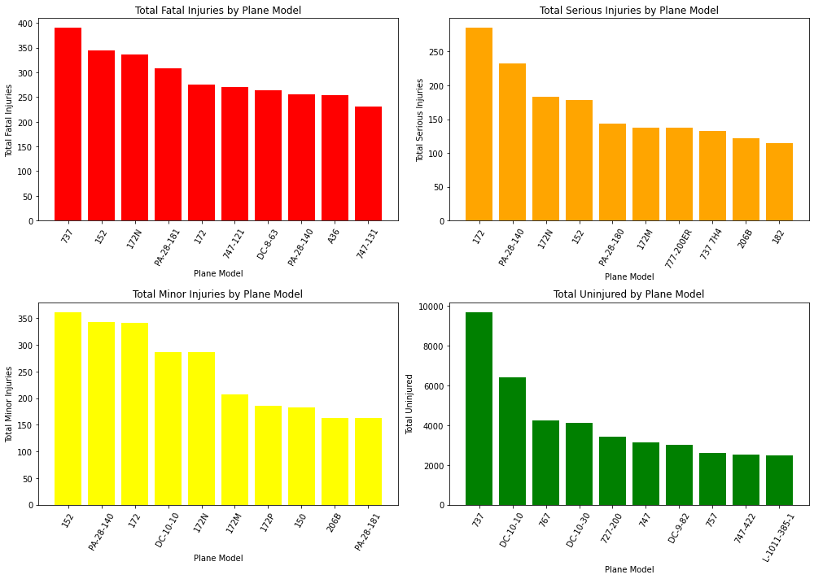
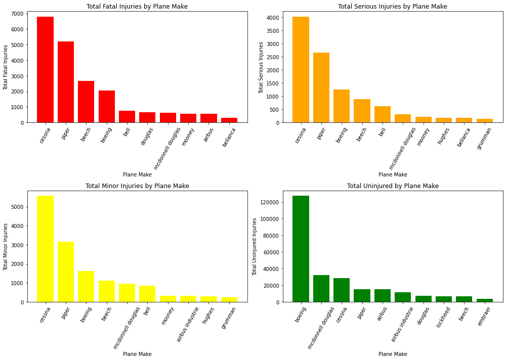

# Aviation Accident Data Analysis

**Author**: [Lucinda Wanjiru](mailto:lucinda.wanjiru@student.moringaschool.com)

## Overview

The company is planning to enter into the aviation industry in order to diversify its assets. Specifically, interested in purchasing and operating airplanes for commercial and private enterprises. A risk assessment is essential to minimize liability and maximize safety. 
This project analyzes data from the National Transportation Safety Board that includes aviation accident data from 1962 to 2023 about civil aviation accidents and selected incidents in the United States and international waters.

A descriptive analysis of the data, including accident frequency, severity by aircraft make and model, impact of weather conditions, relationship between flight purpose (e.g., private vs. commercial), and risks.

The company can use this analysis to determine which aircraft has the lowest operational, financial, and safety risks.

## Business Problem

The company will be able to reduce the risks of safety and financial obligations related to aircraft operation by picking the safest and most reliable models. I aim to:

- Identify low-risk aircraft models.
- Assess the severity and frequency of accidents.

- Assess the elements that contribute to accidents.
- Make recommendations for the best airplanes based on the data analysis results.
This will allow the company to choose which airplanes to purchase.

## Data Understanding

The aviation accident [dataset](https://www.kaggle.com/datasets/khsamaha/aviation-accident-database-synopses) sourced from Kaggle originally obtained from the National Transportation Safety Board contains a detailed record of airplane accidents. Every accident has a unique ID, that is, 'Accident Number' and includes important details such as the date, location, airplane make and model, the severity of injuries, etc. The dataset also captures factors like weather conditions and the phase of flight. This dataset allows for comprehensive analysis of accident patterns, risk factors, etc and to understand the relationship between airplane models, accident severity, and environmental factors.

## Methods

This project uses descriptive analysis, including which summarizes key metrics like total incidents, fatalities, and injury rates. Time Series Analysis identifies trends in accidents over the years. Categorical Analysis compares incidents by aircraft make, model, or purpose of flight. The correlation heatmap visually represents the relationships between the number of engines and the different categories of injuries/uninjured in aviation accidents.


## Results

- Model of the aircraft: model 737. Despite having the most fatalities, it also has the most people who are not hurt. If more safety precautions are put in place, the number of uninjured may outnumber the injured.


- Make of the aircraft: Boeing. It appears to be the safest due to the large number of uninjured and moderate amount of injuries.
  
- Professionally built planes. Professionally built planes have proven to have more uninjured passengers as compared to amateur built ones.
- Type of engine: turbo tan engine it has the most number of uninjured passangers.
If interested in a number of options, consider the following makes:
- Boeing - McDonnell Douglas - Piper - Airbus

## Overall Conclusions:

Based on the analysis of aviation accident data, we can draw the following conclusions:

1.  **Plane Model Impact**:
    *   Different plane models exhibit varying levels of safety.
    *   Model 737 has the most fatal injuries and also the most uninjured passengers, indicating it is a high-volume aircraft but also involved in more severe incidents.
    *   Models 172 and 152 show higher incidences of serious and minor injuries, respectively.

2.  **Plane Make Impact**:
    *   Cessna aircraft are involved in accidents with the highest numbers of fatal, serious, and minor injuries.
    *   Boeing aircraft, while involved in accidents, have the most uninjured passengers, which may suggest better safety features or structural integrity.

3.  **Amateur-Built Planes**:
    *   Non-amateur-built planes are generally safer, with higher numbers of uninjured passengers and fewer fatal injuries compared to amateur-built planes.
    *   Amateur-built planes show a higher incidence of serious injuries. This indicates a potential need for stricter regulations or more rigorous safety checks for amateur-built aircraft.

4.  **Engine Type**:
    *   Turbo fan engines are associated with the highest number of fatal and minor injuries, but they also have the highest number of uninjured passengers.
    *   LR engines have a higher incidence of serious injuries.

5.  **Number of Engines**:
    *   Planes with four engines are involved in the most accidents with fatal injuries, while planes with eight engines have the most serious injuries.
    *   Planes with three engines show the highest number of minor injuries and uninjured passengers.
    *   There is very weak correlation between the number of engines and the severity of injuries or the number of uninjured passengers. This suggests that the number of engines is not a primary factor in determining the outcome of an accident.

### Next Steps

**Further Investigation of High-Risk Models**:
    *   Conduct deeper analyses of plane models like 737, 172, and 152 to understand the underlying causes of accidents and injury patterns. This could involve examining accident reports in detail.

2.  **Improve Safety in Amateur-Built Planes**:
    *   Consider enhancing safety regulations and inspections for amateur-built aircraft, given their higher incidence of serious injuries.
    *   Educational campaigns for builders and pilots of these aircraft could help in reducing accidents.

3.  **Engine Type Safety Reviews**:
    *   Conduct studies to investigate the safety performance of different engine types, focusing on why turbo fan and LR engines might be associated with more severe injury outcomes.
    *   Consider whether different engine types should be subject to different maintenance schedules or pilot training.

4.  **Focus Beyond Number of Engines**:
    *   Given the weak correlation between the number of engines and accident outcomes, safety efforts should focus on factors other than the number of engines.
    *   Investigate plane design, emergency protocols, pilot training, and weather conditions to identify better predictors of accident outcomes.

5.  **Data Collection and Analysis**:
    *   Improve data collection on aviation accidents, ensuring consistent recording of details about plane models, engines, and injury types.
    *   Perform periodic analyses of the data to identify emerging safety issues or trends.

6. **Focus on plane make**:
    * Further investigations should take place regarding Cessna and boeing safety records.
    *  Review and potentially strengthen safety standards for Cessna aircraft.
      
## For More Information

See the full analysis in the [Jupyter Notebook](./aviation_data_notebook.ipynb) or review this [presentation](./presentation.pdf).

For additional info, contact Lucinda Wanjiru at [lucinda.wanjiru@student.moringaschool.com](mailto:lucinda.wanjiru@student.moringaschool.com)

## Repository Structure

```
├── data
├── images
├── pdf
├── README.md
├── presentation.pdf
└── aviation_data_notebook.ipynb
```
